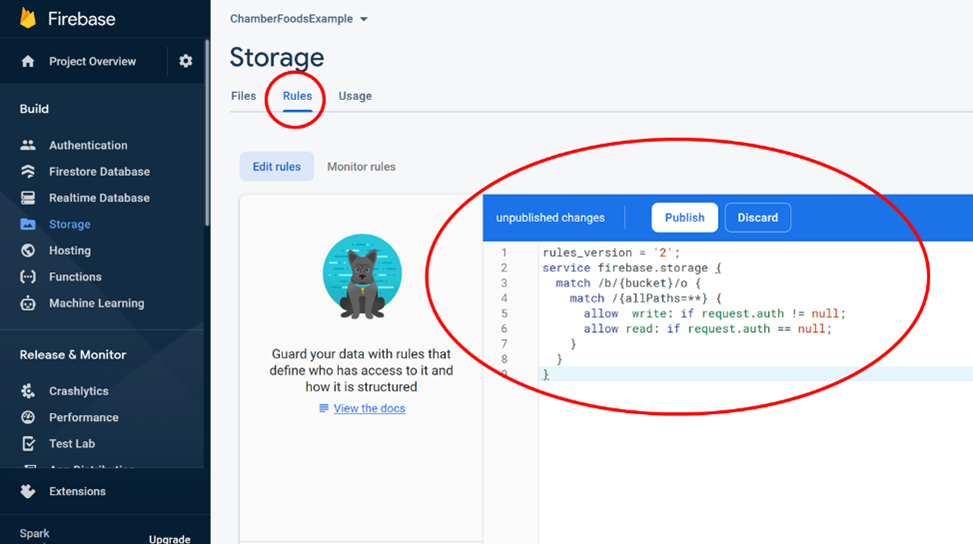
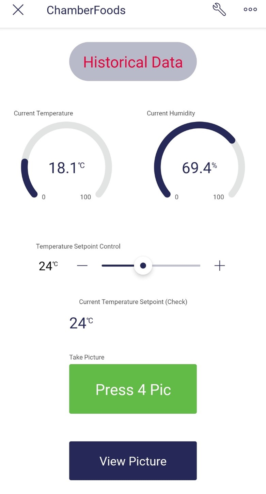

# Project Overview

### Chamber Foods is an IoT project combining smart appliances, artisanal foods, and DIY.

There are a variety of foods that require highly controlled environmental conditions for long periods of time, one such example is cured meats (i.e. charcuterie). Traditionally these processes have been left to master craftspeople, with the risk of failure and inconsistency always a threat due to difficulties in maintaining environmental conditions.

To overcome challenges in maintaining controlled environmental conditions, whilst making the process of environmentally controlled food production more accessible to those non-skilled in the art, Chamber Foods uses temperature and humidity sensor devices, in combination with a Raspberry Pi controller, to measure conditions in a closed environment (i.e. a chamber). To allow easy control over these conditions, users will be able to define set points and monitor the measurements remotely via a series of interfaces. The defined setpoints will trigger automated actuation of heating and cooling processes.

### Sustainability and platform expansion
To support the accessibility of this project to a broad user base, as well as promoting sustainability, it is recommended the chamber consists of a second-hand minifridge. Furthermore, heating will occur via a heater unit. Other proposed units to control humidity include a humidifying unit (cooling/dehumidifying will occur by powering the refrigerator). A fan can also be used to circulate air whenever the heating or cooling units are activated.

The number of units for controlling conditions could also be expanded in the future, including items such:

- UV lights
- Load cells
- Injection ports for air/water/etc
- Extractor fans

### Commercial Potential
Using a second-hand refrigerator within the system means that a potential future business model could provide a near “out of the box solution” for a smart appliance, without the difficulties in distributing bulky refrigerators. Future iterations of the product could seek to generate a community of users within a digital platform sharing different “recipes” for multiple food types, including cured meats, mushrooms, dried fruits, fermented foods, or plants.

# 1	Project architecture 


1.	A DHT22 Digital Temperature Humidity Sensor (AM2302) will measure the temperature and connect to the RPI through GPIO physical pins 7 (data), 6 (ground), and 1 (3v3 power).
2.	Live temperature data will be sent to the Blynk app (V0) from the RPI via WiFi, where it will be displayed as a gauge and chart. 
3.	The temperature setpoint will be selected by the user using the slider widget and transmitted to the RPI (V1) via WiFi. Here, the temperature setpoint will be compared to the measured temperature (Step 1).
4.	If the measured temperature is above the setpoint, this will trigger an event for the RPI to communicate to the RT device (ENER314-RT) through physical pins 17, 14, and 20 (power and grounding), and 13, 15, 19, 21, 22, 23, and 26 (data).
5.	The RT device (ENER314-RT) will then switch on the appropriate adapter on the RT-controlled power-board (ENER010) via 433MHz RF transmission. 
6.	The RT-controlled power-board (ENER010) will then power on the refrigerator with 220V mains electricity. 
7.	Temperature and humidity conditions will be continuously transferred and logged to different channels in ThingSpeak via the ThingSpeak MQTT broker. 
8.	The device’s ThingSpeak channels will be linked to Twitter via the  ThingTweet app, and the React app will then be used to send a tweet to the related Twitter account if a critical temperature level is breached.
9.	To check on the state of the fridge’s contents, the user can click a button on the Blynk app which will be transmitted to the RPI (V2) via WiFi.
10.	If the button is activated the RPI camera will be used to take a picture of the contents of the fridge while the button is being pushed, in doing the image will be transmitted to the Firebase Realtime Database and Storage.
11.	The current image will then be displayed in web-based app on Glitch, also presenting the time and date of the most current image. 
12.	For ease of access, a linker button on the Blynk app will be added to take the user directly to the Glitch website to view the most current image of the fridge contents. 
13.	For ease of access, a linker button on the Blynk app will be added to take the user directly to the ThingSpeak website to view logged data.

# 2	Components 


•	Raspberry Pi 4 B (including charger and SD card)
 
 

•	Raspberry Pi Camera
 

•	Energenie ENER314-RT Two-Way Pi-Mote


•	Energenie ENER010 4 Way Remote Control Extension Lead
 

•	Seeed Studio Grove Temperature and Humidity Sensor Pro Module (DHT22/AM2302)
 
 
•	CanaKit Raspberry Pi GPIO Breakout Board Bundle
 

# 3	Assembling Components

1.	Attach the Pi Camera to the Raspberry Pi (RPi), as per the instructions here (note, camera may face in opposing orientation to the image below, depending on the orientation of the connector pins in relation to the RPi). 


2.	Connect the RPi GPIO pins to the Breadboard in the CanaKit using the T-Cobbler. 


3.	It is now necessary to connect the ENER314-RT unit and the DHT/AM2302 sensor unit to the breadboard. Typically, the ENER314-RT sits on the GPIO pins of the RPi as follows: 

 
However, this is not possible if the pins also need to be accessed by the DHT/AM2302 sensor. Therefore, we can wire only the necessary pins as described by the Energenie website (see here), as per the schematic below. 


4.	The DHT/AM2302 unit can now be similarly wired to the unused GPIO pins via the breadboard, including ground (black wire, pin number 6, ground), power (red wire, pin number 1, 3v3 Power), and data (yellow wire, pin number 7, GPIO 4). The resultant configuration should look something like as follows:      


5.	The RPi can now be powered up and accessed (e.g. via SSH). 

# 4	Connecting to the remote-controlled extension lead

Make sure that the RPi and required dependencies are up-to-date by running the following: 
```
sudo apt-get update
sudo apt-get upgrade
sudo apt-get install build-essential python3-dev
sudo apt-get install python3-gpiozero
```

To control the Energenie products using Python, I first cloned the Python library compiled by Whaleygeek (David Whale) from Github:

`git clone https://github.com/whaleygeek/pyenergenie.git`

Within this library, I have copied the energenie folder, located in: 

`~$ cd pyenergenie/src`

With this library installed, you can then use the ENER314-RT to connect to the individual power sockets of the ENER010. Plug in the ENER010 to a mains power socket and press the green button (about 5 seconds) until the orange light is flashing at 1 second intervals. This means the device is in learning mode. Run the script: 

`~/ChamberFoods $ python3 learnsocket1.py`

This will cause the first socket to match with the signal sent by the ENER314-RT and turn on and off, meaning the device signal for its first channel has now been learned. To connect the device with sockets 2, 3, and 4, repeat the process using the learnsocket2.py, learnsocket3.py, and learnsocket4.py scripts, respectively, ensuring that the extension board is put into learning mode each time by clicking the green button and waiting for the orange flashing light. If needed, the extension board can be fully reset by holding the green button and waiting for the orange light to flash rapidly. 

# 5	Setting up the DHT22/AM2302 Temperature and Humidity sensor

To control the Seeed Studio products using Python, I first installed the Python library from [here](https://github.com/Seeed-Studio/grove.py) using the single line method: 

`curl -sL https://github.com/Seeed-Studio/grove.py/raw/master/install.sh | sudo bash -s –`

I then cloned the specific library for DHT devices from Github: 

`git clone https://github.com/Seeed-Studio/Seeed_Python_DHT`

Within this library I have specifically copied the script: 

`seeed_dht.py`
 
To check the DHT22/AM2302 sensor is working run the script: 

`~/ChamberFoods $ python3 temphumi.py`

This should produce a readout something like: 

```
DHT22, humidity 63.4%, temperature 19.0*
DHT22, humidity 63.4%, temperature 19.0*
DHT22, humidity 63.3%, temperature 19.0*
DHT22, humidity 63.4%, temperature 19.0*
DHT22, humidity 63.4%, temperature 19.0*
DHT22, humidity 63.4%, temperature 19.0*
```

Once all the hardware is working it is then necessary to set up the different software platforms. 

# 6	Setting up the Blynk app

I have used the [Blynk](https://blynk.io/) platform for developing an app that can be used to read live sensor readings, adjust setpoint values, and even view the contents of the Chamber via the Pi Camera. After setting up an account, I first created a new template called ChamberFoods


Within the template, I set up 5 datastreams on virtual pins as follows: 


Once the template was formed (including the addition of widgets on the web-dashboard), a new device was created based on the ChamberFoods template. 


 
I then set up the device and widgets on the Blynk app as per below: 


# 7	Setting up Firebase and Glitch to view Chamber contents

The Blynk app configuration shown previously includes a “Press 4 Pic” option (virtual channel V0), which I’ve used to create an event for the Raspberry Pi. Images taken are stored on the Raspberry Pi, but to avoid issues with space limitations, I have set up a Firebase account for publishing the image events on the cloud. I have then developed a web-app in Glitch, which can be viewed using the “View Picture” button (i.e. webpage viewing button) in Blynk.

To setup the Firebase account, I signed in using my Google account and started a new project, “ChamberFoods” (I did not enable Google analytics). The two services I wanted to utilise were Runtime Database and Storage. 

To create the Realtime Database, I clicked on the corresponding menu in the left column and clicked “Create Database”, ensuring to choose the appropriate server location relative to my location and starting in test mode. 


Similarly, to create Storage, I clicked the corresponding menu in the left column and clicked “Get Started”, again choosing the appropriate server location for my current location. 


 
Within the Rules tab on the Storage page, I updated the code as follows to allow Glitch to read the storage:

```
rules_version = '2';
service firebase.storage {
  match /b/{bucket}/o {
    match /{allPaths=**} {
      allow  write: if request.auth != null;
      allow read: if request.auth == null;
    }
  }
}
```


On the RPi, I then installed the Firebase Administration package: 

`pip3 install firebase-admin` 

To allow the Glitch web-app to access the Firebase ChamberFoods project, I created a web app on Firebase by clicking “Project Overview” on the left menu and selecting the web-app option. 


 
Choose a suitable name, register the app, and click “Continue to console”. 


 
Click the “1 App” option:


Select the “Settings” option for your app:


 
Select the “Service accounts” option and click “Generate new private key”


 
I then saved this key on the RPi under the name “serviceAccountKey.json”.

Within the Storage I copied the ID (not including "gs://") and within the Realtime Database I copied the web address, which I then used within the “storeFileFB.py” script as the ‘storage bucket’ and ‘databaseURL’ values respectively.


 
Within Glitch, I created a New Project and updated the index.html and script.js to accommodate the Firebase project. Note, you will need to update the firebaseConfig in your own script.js by accessing the “Settings” options within Project Overview once more and scrolling to SDK snippet within the “General” tab.  

 

 

# 8	Using Blynk to capture and view pictures

Having already assigned the “TakePic” data stream to the “V0” virtual pin in the Blynk template, I could then assign the “V0” virtual pin to the “Take Picture” button in the Blynk app. Using this button, the V0 value could be modified and used to take pictures on the RPi camera and using the Firebase project to store images, which could then be incorporated within the Glitch webpage. It should be noted that an “img” folder was first created to store image files locally on the RPi. The “View Pic” webpage load button on the Blynk app was then connected with the webpage address of the Glitch webpage, so the “Take Picture” button would take a picture and the “View Pic” button would display the picture (via the webpage). 

To check all elements are connected and interacting correctly, run the cameracheck.py script and use the buttons on the Blynk app to take and view pictures. 
It should be noted that the takepicture.py script is separate from the chamberfoods.py script, but called withing the chamberfoods.py script. This is in order to avoid the error: 

`picamera.exc.PiCameraMMALError: Failed to enable connection: Out of resources`

Essentially the camera is started and closed each time with the takepicture.py script so the camera does not think it is starting twice if the chamberfoods.py script is stopped and started again. 

# 9	Using ThingSpeak to capture data

To capture the temperature and humidity data and set alarms for breaches of thresholds, I set up a ThingSpeak account. After setting up an account and logging in, I then created a new channel called “ChamberFoods”, with fields including temperature and humidity. 

 

Within the Devices menu, select the MQTT option and click the “Add a new device” button. Enter a device name and select the “ChamberFoods” channel before clicking the “Add Device” button. 

 
 
When shown the MQTT credentials for the new device, download as plain text and save (be sure to capture password as it will not be available elsewhere). These credentials should now be inputted into your .env file, along with your channel ID and transmission interval (I used 15 seconds).

 

In order to create a TLS connection, use the broker.thingspeak.crt file to enter a certificate (for example as generated using OpenSSL). 

To begin sending data to the ThingSpeak MQTT, run the script as follows: 

`python3 chamberfoodsthingspeak.py`

This should be done using a separate terminal to the main script (chamberfoods.py). 

In order to view the ThingsSpeak data on the Blynk app, use the “Historical Data” webpage load button previously shown on the app to enter the web address of your ThingSpeak channel (note, the channel will need to be set to public). For example, it should look something like: 

https://thingspeak.com/channels/123456

# 10	Linking ThingSpeak to Twitter

Within the Apps menu of ThingSpeak, select ThingTweet and click the “Link Twitter Account” button. Here you can link an existing Twitter account via your user name and password (potentially a good idea to start a new Twitter account for your RPi). 
Once again within the Apps menu of ThingSpeak, select the React option and click the “New React” button. Fill in the fields to create an alert, for example if the temperature is too high send a Tweet, and press “Save”. 

 
 
# 11	Running the Chamber Foods system

## 11.1	Positioning components for running the Chamber Foods system

As it is currently coded, the two major components to be plugged into the ENER010 extension board include a refrigerator (socket 1) and a light/lamp (socket 2). These two components will be used for cooling and providing light whilst taking a picture, respectively, however additional components can be added to the code that would further aid the control of environmental conditions. For example, you could group sockets by cooling components (e.g. fridge, fan), heating components (e.g. heat mat, heat lamp), humidifying components (e.g. humidifier), and dehumidifying components (dehumidifier, extraction fan). There is also the possibility to add further lighting components to sockets (e.g. UV) as desired. 

It is intended that the ENER010 board remains outside the fridge (chamber), but components such as the lamp will need to be placed within the fridge. Similarly, the RPi, RPi camera, and breakout board with ENER314-RT and DHT22 sensor will all need to be housed within fridge, with an extended charger cord running to an outlet outside. To protect these components whilst in the fridge it may be possible to fashion some sort of container that can be placed away from potential contaminants. It would be beneficial to have the temperature/humidity sensor close to the region of interest (e.g. where the food is being contained) and the RPi Camera positioned towards the items within the chamber/fridge for viewing.                                                                                                                               

## 11.2	Operating the system

The two main scripts for running the basic Chamber Foods system from the RPi include: 

```
chamberfoods.py
chamberfoodsthingspeak.py
```

While these two scripts are responsible for controlling all the data transfer, the user control and data display of the system is conducted through the Blynk app. 

Before running the main scripts, within the chamberfoods.py script, check the values for “setvalue” and “tempidletime” variables. The “setvalue” variable represents the starting point for the setpoint temperature to control against. This can be modified using the Blynk app but can be set from the outset if necessary, within the script. The “tempidletime” refers to the amount of time the cooling unit (e.g. fridge) should wait before turning on or off again. This can be important if you want to avoid damaging the cooling system of your fridge, for example. A recommended value might be 900 (i.e. 15 minutes). 

Within Visual Studio Code or another code editor, access the RPi via SSH, open a terminal, navigate to the ChamberFoods directory and run the chamberfoodsthingspeak.py script as follows: 

`python3 chamberfoodsthingspeak.py`

This will begin sending data to the ThingSpeak channels on the temperature and humidity. 

 
 
Keep the `chamberfoodsthingspeak.py` script running and open a new terminal, navigate to the ChamberFoods director, and run the `chamberfoods.py` script as follows: 

`python3 chamberfoodsthingspeak.py`

This will begin communicating with your remote-controlled sockets, RPi camera, DHT22 sensor, and Blynk app. 

 
 
Now that the main script is running, in addition to the ThingSpeak script, open the Blynk app (see Section 5) and select the ChamberFoods device, which should now be online. 
 
 
 

You will note that initially, the “Current Temperature Setpoint (Check)” is matching the “setvalue” variable in the script and not the “Temperature Setpoint Control” value on the Blynk app slider. Use the slider to change the setpoint and this should now update the “setvalue” variable and subsequently the Check value on the app. 

*Note, if changing the Setpoint Control slider on the app does not cause a change in the Check value, leave the app running, stop the chamberfoods.py script momentarily (i.e. ctrl + z) and restart (i.e. python3 chamberfoods.py). Once the script is running again, use the slider once more and make sure the Check value changes accordingly (this can sometimes take a few seconds). 

 
 
To take a picture, click the “Press 4 Pic” button on the Blynk app. This will cause the fridge lamp (socket 2) to turn on while a picture is being taken before then turning off again. The event will be logged in the terminal. 


To view the picture, click the “View Picture” button on the Blynk app. 


 
To check the recorded data on the ThingSpeak channel, click the “Historical Data” button on the Blynk app, which will take you to the ThingSpeak temperature and humidity charts. 


## 11.3	Alternative control system

As mentioned previously, it is possible to add additional components to the Chamber Foods system. As an example, the following script assumes a heating element has been plugged into socket 3: 

`chamberfoods2.py`

Also within this script, a slightly more complicated control system has been used, where heating and cooling components are not activated until a threshold beyond the relevant setpoint. Once these components are activated, they are then deactivated before reaching the setpoint to avoid an overshoot occurring. This system would require some refinement to ensure the activation and deactivation levels are suitable for the heating and cooling elements. More sophisticated controller systems could also be employed in future systems, such as proportional–integral–derivative (PID) controllers. 


